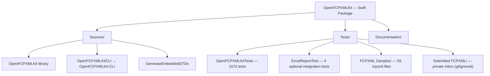
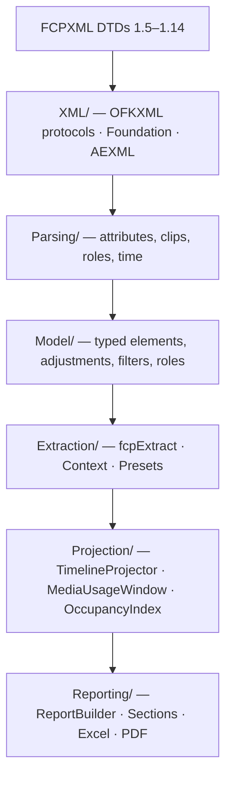
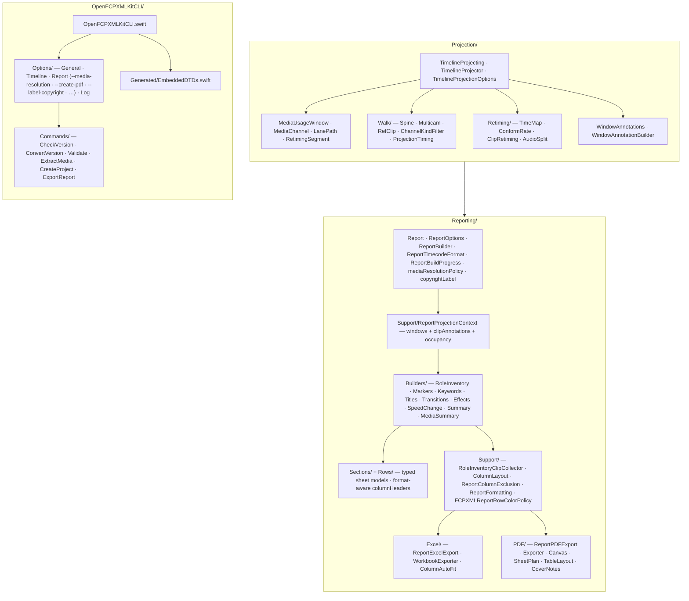
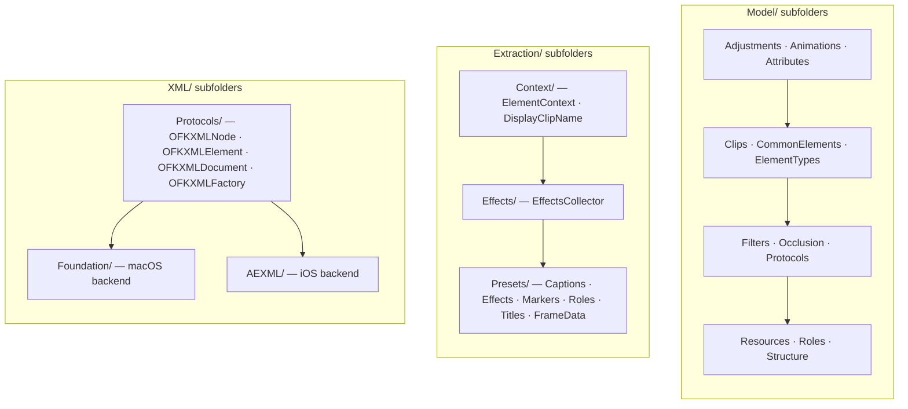

# OpenFCPXMLKit — Architecture & Conventions

A guide for contributors: project structure, architecture, naming, styling, and design decisions.

**See also:** [GUARDRAILS.md](GUARDRAILS.md) (must / must-not), [.cursorrules](.cursorrules), [AGENT.md](AGENT.md), [Tests/README.md](Tests/README.md).

---

## 1. Project overview

OpenFCPXMLKit is a **Swift 6** framework for Final Cut Pro FCPXML: parsing, creation, manipulation, and timecode operations (via SwiftTimecode). It is **protocol-oriented** and **dependency-injected**: core behaviour is behind protocols; default implementations are injectable; extension APIs that cannot take parameters use a single shared instance.

- **Package:** `OpenFCPXMLKit` (`swift-tools-version: 6.3`)
- **Products:** `OpenFCPXMLKit` (library, includes XLKit Excel export), `OpenFCPXMLKit-CLI` (executable), `GenerateEmbeddedDTDs` (internal build tool)
- **Targets:** macOS 26+, iOS 26+, Xcode 26+, Swift 6.3+
- **Repository:** https://github.com/TheAcharya/OpenFCPXMLKit
- **Dependencies:** SwiftTimecode 3.1.2+, SwiftExtensions 3.0.0+, SwiftSemanticVersion 1.0.0+, swift-log 1.14.0+, AEXML 4.7.0+, swift-argument-parser 1.8.2+ (CLI only), Foundation, CoreMedia.
- **FCPXML:** Versions 1.5–1.14 (DTDs included); Final Cut Pro frame rates (23.976, 24, 25, 29.97, 30, 50, 59.94, 60).
- **Tests:** **1076** tests listed in `swift test --list-tests` — **1072** in `OpenFCPXMLKitTests` (1069 XCTest `func test` + 3 Swift Testing `@Test`) and **4** optional `ExcelReportTest` integration tests; **59** sample `.fcpxml` files under `Tests/FCPXML Samples/FCPXML/`; private local inbox under `Tests/Submitted FCPXML/` (gitignored — never commit private FCPXML).

---

## 2. Architecture

### 2.1 Protocol-oriented design

All major operations are defined as **protocols** with both **sync** and **async/await** methods. Default implementations live in `Implementations/`; callers inject dependencies into `FCPXMLUtility` or `FCPXMLService`.

| Protocol(s) | Implementation |
|-------------|----------------|
| FCPXMLParsing, FCPXMLElementFiltering | FCPXMLParser |
| TimecodeConversion, FCPXMLTimeStringConversion, TimeConforming | TimecodeConverter |
| XMLDocumentOperations, XMLElementOperations | XMLDocumentManager |
| ErrorHandling | ErrorHandler |
| CutDetection | CutDetector |
| FCPXMLVersionConverting | FCPXMLVersionConverter |
| MediaExtraction | MediaExtractor |
| MIMETypeDetection | MIMETypeDetector |
| AssetValidation | AssetValidator |
| SilenceDetection | SilenceDetector |
| AssetDurationMeasurement | AssetDurationMeasurer |
| ParallelFileIO | ParallelFileIOExecutor |
| ServiceLogger | NoOpServiceLogger, PrintServiceLogger, FileServiceLogger |

Semantic and DTD validation use **concrete structs** (`FCPXMLValidator`, `FCPXMLDTDValidator`, `FCPXMLStructuralValidator`) that are injected; they are not behind protocols.

### 2.2 Single injection point for extensions

Extension APIs that **cannot take parameters** (e.g. `CMTime.fcpxmlString`, `XMLElement.fcpxDuration`) use **`FCPXMLUtility.defaultForExtensions`** (concurrency-safe). For custom services, use the **modular API** with the `using:` parameter (e.g. `CMTime+Modular`, `XMLElement+Modular`, `XMLDocument+Modular`).

- **Rule:** No hidden concrete types in extension APIs; use `defaultForExtensions` or inject via `using:`.

### 2.3 Facades

- **FCPXMLService** — Preferred facade: inject dependencies and call service methods (parse, convert, validate, save, media operations). Sync and async.
- **FCPXMLUtility** — Legacy/convenience facade; same dependencies and behaviour. Holds `defaultForExtensions`.
- **ModularUtilities** — `createService()` / `createCustomService()` for building a default or custom `FCPXMLService`; `validateDocument(_:)`; `processFCPXML(from:using:)`; `convertTimecodes(...)`.

### 2.4 Concurrency

- **Sendable** where appropriate; Swift 6 strict concurrency (`-strict-concurrency=complete`) in CI.
- **Foundation XML** (XMLDocument, XMLElement), the **OFKXML** protocol types (OFKXMLDocument, OFKXMLElement) that wrap them, and **SwiftTimecode** types are not Sendable. The codebase provides **async/await** APIs but avoids Task-based concurrency over these types.
- Use `async/await` for asynchronous operations; use `Task`/`TaskGroup` only where types are Sendable.

### 2.5 Cross-platform XML (iOS support)

- **XML abstraction:** All document/element access goes through **protocols** (OFKXMLNode, OFKXMLElement, OFKXMLDocument, OFKXMLFactory). On **macOS** the default backend is Foundation (FoundationXMLElement, FoundationXMLDocument, FoundationXMLFactory). On **iOS** the backend is AEXML (AEXMLBackendElement, AEXMLBackendDocument, AEXMLBackendFactory). Use **OFKXMLDefaultFactory()** so the correct backend is used for the current platform.
- **DTD validation:** Full DTD validation is macOS-only. **FCPXMLDTDValidator** on iOS uses **FCPXMLStructuralValidator** (root, version, resources, element allowlist) and may add a `structuralValidationOnly` warning.

### 2.6 Error handling

- **Sync:** `Result<T, FCPXMLError>` or `do`/`catch`.
- **Async:** `throw` and propagate `FCPXMLError` (e.g. `parsingFailed(Error)`).
- **Module errors:** `FCPXMLError`, `FCPXMLLoadError`, `FCPXMLExportError`, `FCPXMLBundleExportError`, `FinalCutPro.FCPXML.ParseError`, `TimelineError`. Parse failures from all layers surface as `FCPXMLError.parsingFailed`.

### 2.7 Reporting and core layers

Workbook **reporting** (`Reporting/`) sits at the top of the stack. It maps already-extracted FCPXML facts into row models and sheet sections. It is **not** where new FCPXML semantics should first be implemented.

When FCPXML grows more complex (nested sync-clips, compound clips, richer adjustments, role inheritance, occlusion, per-span metadata), extend the engine **bottom-up** so CLI, extraction presets, timeline tools, and reports share one foundation:

```text
XML/              OFKXML protocols and platform backends (Foundation, AEXML)
    ↓
Parsing/          Attribute and structure parsing (time, roles, clips, metadata)
    ↓
Model/            Typed elements, adjustments, filters, roles, occlusion
    ↓
Extraction/       fcpExtract, ExtractionScope, timeline/role context
    ↓
Projection/       TimelineProjection → MediaUsageWindow
    ↓
Reporting/        Row models, builders, sheet-specific presentation rules
```

**Timeline Projection:** Mid-layer under `Sources/OpenFCPXMLKit/Projection/` that projects sequences into playable **media usage windows** (channel, lane path, retiming): identity and `timeMap`/`conform-rate` retiming; nested spines / anchored children and J/L cuts; multicam active/all angles, ref-clip sequence unfold, audition mask, `video`/`audio` leaves, `ChannelKindFilter` / `srcEnable`. When any of Role Inventory, Markers, Keywords, Titles & Generators, Transitions, Effects, Speed Change, Media Summary, or Summary is enabled, `ReportBuilder` projects **once** per timeline and shares `ReportProjectionContext` (windows + `ProjectedClipAnnotations` + `TimelineOccupancyIndex`). Markers / Keywords / Titles / Transitions / Effects are **Projection-first** with Extraction fallback. Excel/PDF remain presentation-only. See Manual [20 — Timeline Projection](Documentation/Manual/20-Timeline-Projection.md).

**1. Model and Parsing** — Add or extend typed coverage first:

- New element types in `FCPXMLElementType` and `Model/` (clips, adjustments, filters, resources).
- Attribute parsing in `Parsing/` and element extensions on `OFKXMLElement`.
- Shared value types (e.g. transform adjustments, volume spans) that any consumer can reuse.

**2. Extraction** — Expose consistent context for callers:

- Timeline absolute start/end via extraction context (`ExtractedElement`, `ElementContext`).
- Inherited roles, occlusion, sync/mc/ref-clip traversal rules in `Extraction/`.
- Presets and scope flags (`ExtractionScope`, `includeDisabled`, `occlusions`) rather than ad hoc XML walks.

**3. Reporting** — Keep thin:

- Builders prefer **Projection** facts (`ReportProjectionContext`) when available, with Extraction fallback for discovery-shaped sections (Markers, Keywords, Titles, Transitions, Effects).
- Sheet-specific **presentation policy** only: column order, string formatting (including `ReportTimecodeFormat`), sort order (numeric for Frames / Feet+Frames), inclusion allowlists (e.g. which custom filters appear on an effects sheet), global column exclusion (`ReportColumn`, `ReportColumnExclusion` including **`ensuringRowColumn`** / **`allowsInjectedRowColumn`** so **Row** is on all tabular Excel/PDF sheets by default), format-aware timecode column headers, shared row text colours (`FCPXMLReportRowColorPolicy` — used by Excel and PDF), workbook/PDF cell colours (`FCPXMLReportWorkbookExporter`, `RoleRowColorContext` on Excel; PDF applies the same policy via CoreGraphics), optional cover-sheet / cover-page branding (`Report.exportBrandingText`), and optional copyright / attribution (`ReportOptions.copyrightLabel` / `Report.copyrightLabel` — Excel cover **A2**; PDF cover below branding; PDF footer centre; CLI `--label-copyright`).
- `ReportOptions.excludeDisabledClips` flows into Extraction scope and `TimelineProjectionOptions.forReport` so disabled clips are omitted consistently.
- `ReportOptions.mediaResolutionPolicy` (`.failSoft` / `.failLoud`; CLI `--media-resolution`) controls whether projection failures abort the build; missing files on disk always remain Media Summary content.
- `ReportOptions.mediaSummaryDistinguishProxyAndOriginal` (CLI `--media-summary-distinguish-proxy`) splits Missing Original / Missing Proxy columns when Projection windows carry both URL kinds.
- `ReportOptions.timecodeFormat` is stored on `Report.timecodeFormat` and drives cell strings plus Excel/PDF header suffixes (e.g. `Timeline In (frames)`).
- `ReportOptions.copyrightLabel` is stored on `Report.copyrightLabel` (whitespace-normalized) and applied by Excel cover export and PDF cover/footer rendering.
- Build / progress order is **`ReportBuildPhase.enabledPhases(for:)`** (product / workbook order: Selected Roles Inventory first, then Markers … Media Summary; includes `.projecting` when sections consume Projection). `ReportBuilder` and CLI/GUI progress share this list.
- **Timeline resolution** for `buildReport` / `ReportBuilder` uses **`FinalCutPro.FCPXML.allReportTimelineSources()`** (defined on `FCPXMLProperties`): every `<project>` sequence, plus event-level compound clips (`ref-clip` → `media`/`sequence`) when FCP exported a compound clip with no `<project>`. Prefer a real project when both exist. `ReportOptions.projectName` / CLI `--report-project` match project or compound-clip display names. Discovery belongs on `FCPXML` (Classes); Reporting only consumes `ReportTimelineSource`.
- **Summary Excel layout:** project title in **B1** (narrow **Row** column A; generous title width on B). **PDF cover:** black header band with white `info.circle` + “About This PDF Export”; body notes reference default/excludable Row; optional `copyrightLabel` under Created-by (same subtitle font) and centred in the running footer (same footer font).
- Do **not** duplicate timeline math, role resolution, or element traversal that belongs in Extraction/Model/**Projection**.

**Where to put a change**

| Concern | Layer |
|--------|--------|
| New `adjust-*` or `filter-*` element understood from XML | Model, Parsing |
| Correct absolute timeline for a nested clip or effect span | Extraction (context); **Projection** when composed retiming / channel windows are required |
| Playable media occupancy (A/V channels, nested lanes, speed/reverse/conform, split edits, audition/multicam visibility) | **Projection** (`TimelineProjection` / `MediaUsageWindow`) |
| Discover project vs standalone compound-clip report timelines | Classes (`allReportTimelineSources` / `ReportTimelineSource`); Reporting resolves via that API |
| Which rows appear on a given workbook sheet | Reporting |
| Column labels, timecode strings, enabled checkmarks | Reporting |
| Timecode display mode (SMPTE / Frames / Feet+Frames / HH:MM:SS) and header suffixes | `ReportOptions.timecodeFormat` → `Report.timecodeFormat` → Formatting + Excel/PDF export |
| Optional copyright / attribution line (Excel cover A2; PDF cover + footer centre) | `ReportOptions.copyrightLabel` → `Report.copyrightLabel` → Excel / PDF export (CLI `--label-copyright`) |
| Build / progress / GUI section order | `ReportBuildPhase.enabledPhases(for:)` |
| Omit `enabled="0"` clips from all timeline sections | `ReportOptions.excludeDisabledClips` → Extraction scope + `TimelineProjectionOptions.forReport` |
| Projection failure abort vs continue | `ReportOptions.mediaResolutionPolicy` (`.failSoft` / `.failLoud`; CLI `--media-resolution`) |
| Media Summary Missing Original / Missing Proxy columns | `ReportOptions.mediaSummaryDistinguishProxyAndOriginal` (CLI `--media-summary-distinguish-proxy`) |
| Omit named columns from every applicable sheet (incl. **Row** on all tabular sheets + PDF injection) | `ReportOptions.excludedColumns` → `Report.excludedColumns` → Excel and PDF export (`ensuringRowColumn` / `allowsInjectedRowColumn`) |
| Workbook/PDF row text colours (inventory role category; section-sheet inference; Summary header-style title in B1 + black data; Media Summary red paths; marker-type colours) | `FCPXMLReportRowColorPolicy` (+ `FCPXMLReportWorkbookExporter` on Excel; PDF renderer applies same policy) |
| Missing media path list | Media Summary builder (`mediaBaseURL` for relative paths) |

**Workflow when a report gap appears**

1. Confirm whether the fact already exists in Model, Extraction, or Projection; use it if so.
2. If the gap is occupancy/retiming/channel visibility, implement or extend **Projection**. If the raw XML fact is missing, implement it in Model/Parsing, then Extraction.
3. Only then add or adjust Reporting builders to map that fact to rows.
4. Add **core** tests (parsing, extraction, projection, occlusion, roles) alongside **report** integration tests that assert row shape against an optional local FCPXML fixture.

#### Excel export

Lives under **`Reporting/Excel/`** and serialises `Report` to XLKit workbooks via `ReportExcelExport` and `FCPXMLReportWorkbookExporter`; it applies column exclusion (including format-suffixed timecode headers and universal **Row** via `ensuringRowColumn`), `Report.timecodeFormat` header suffixes, tabular header styling (black fill, white bold text), Summary project title in **B1** with narrow Row column A, cover-sheet branding (`workbookCoverSheet` / `exportBrandingText` in **A1**) plus optional `copyrightLabel` in **A2**, and sheet-specific row text colours but should not introduce new FCPXML interpretation.

#### PDF export

Lives under **`Reporting/PDF/`** and serialises the **same** `Report` to a multi-page A4 landscape PDF via `ReportPDFExport` and `FCPXMLReportPDFExporter` (CoreGraphics). Build the report once; export to Excel, PDF, or both. PDF respects the same section flags, `excludedColumns` (including **Row** / `allowsInjectedRowColumn`), `timecodeFormat`, role/disabled-clip filtering, `copyrightLabel`, and row colours. PDF-only presentation: cover page with black **“About This PDF Export”** header band + white `info.circle` (`FCPXMLReportPDFCoverNotes`); `exportBrandingText` then optional `copyrightLabel` (same subtitle font/size); running footer left branding + centred copyright + page number (footer font/size); dynamic table of contents with **accent-palette colour chips** and light **content-tint washes** keyed to each sheet title’s sequential `colorIndex` (same index as per-sheet content tints, including role sheets via `FCPXMLReportPDFSheetPlan`); per-sheet tinted content zones across vertical and horizontal continuations; table columns measured then **expanded to fill content width** when leftover space remains after packing/`excludedColumns` (`FCPXMLReportPDFTableLayout`; pinned Row); horizontal/vertical table pagination; ellipsis truncation. These layout helpers are **internal** — public API remains `ReportPDFExport` / `Report` / `ReportOptions`. CLI: `--create-pdf` and `--label-copyright` (with `--report`).

---

## 3. Project structure

### 3.1 Codebase map

The package builds one library, one CLI executable, and one internal build tool. The diagrams below read **top to bottom**. The library is layered bottom-up (see §2.7): **FCPXML DTDs** and the platform-agnostic **XML** layer feed **Parsing**, which builds the typed **Model**, which **Extraction** exposes with timeline/role context, which **Projection** turns into playable media windows, which **Reporting** maps into workbook/PDF sheets. Cross-cutting subsystems (Classes, Implementations, Protocols, Services, Timeline, Export, Validation, etc.) sit alongside that pipeline.

#### Package layout



#### Library layer stack (bottom → top)



#### Reporting, Projection consume, and CLI



#### Model, Extraction, and XML subfolders



**Cross-cutting library folders** (alongside the layer stack): Analysis, Annotations, Classes, Delegates, Errors, Extensions (+Modular, +Codable), Implementations, Protocols, Services, Utilities, Export, Timeline, Timing, Validation, FileIO, Media, Logging, Format.

### 3.2 Library folders

Source layout under **`Sources/OpenFCPXMLKit/`**:

| Folder | Purpose |
|--------|---------|
| **Analysis** | EditPoint, CutDetectionResult (cut detection). |
| **Classes** | FinalCutPro, FCPXML, FCPXMLElementType, FCPXMLUtility, FCPXMLVersion, FCPXMLRoot, FCPXMLRootVersion, FCPXMLInit, FCPXMLProperties (`allProjects`, `allTimelines`, `allReportTimelineSources` / `ReportTimelineSource` for project + standalone compound-clip report timelines). |
| **Delegates** | AttributeParserDelegate, FCPXMLParserDelegate (internal). |
| **Errors** | FCPXMLError, FCPXMLParseError, TimelineError. |
| **Extensions** | CMTime, XMLElement, XMLDocument (+Modular, +Codable, and non-modular). FCPXML extensions operate on OFKXMLElement/OFKXMLDocument protocol types. |
| **Implementations** | Default implementations of all protocols above. |
| **Protocols** | All operation protocols. |
| **Services** | FCPXMLService. |
| **Utilities** | ModularUtilities, FCPXMLTimeUtilities, FCPXMLUID, FCPXMLCodableConverter, EmbeddedDTDProvider, FCPXMLDTDAllowlistGenerator, ProgressBar, ProgressBarStyle, SequencePlusAnySequence, XMLElementAncestorWalking, XMLElementSequenceAttributes. |
| **Annotations** | Marker, ChapterMarker, Keyword, Rating, Metadata (creation-oriented). |
| **Export** | FCPXMLExporter, FCPXMLBundleExporter, FCPXMLExportAsset. |
| **Timeline** | Timeline, TimelineClip (TimelineFormat presets live in Timeline.swift). |
| **Timing** | FCPXMLTimecode. |
| **Validation** | FCPXMLValidator, FCPXMLDTDValidator, FCPXMLStructuralValidator (cross-platform; used on iOS when DTD unavailable), ValidationResult, ValidationError/Warning, DocumentValidationReport. |
| **FileIO** | FCPXMLFileLoader. |
| **Logging** | ServiceLogger, ServiceLogLevel, NoOp/Print/FileServiceLogger. |
| **Media** | MediaReference, MediaExtractionResult, MediaCopyResult. |
| **Format** | ColorSpace. |
| **Model** | FCPXML element models: Adjustments, Animations, Attributes, Clips, CommonElements, ElementTypes, Filters, Occlusion, Protocols, Resources, Roles, Structure (CollectionFolder, KeywordCollection, etc.). |
| **Parsing** | XML parsing extensions (Attributes, Clip, Elements, Metadata, Resources, Roles, Root, Time and Frame Rate). |
| **Extraction** | `fcpExtract`, ExtractedElement, ExtractionScope, ExtractableChildren. **Context/** (DisplayClipName, ElementContext, ElementContextItems/Tools, FrameRateSource), **Effects/** (EffectsCollector, ExtractedEffect), **Presets/** (Captions, Effects, FrameData, Markers, Roles, Titles, plus the base ExtractionPreset). |
| **Projection** | Timeline analysis mid-layer. `TimelineProjecting`, `TimelineProjector`, `TimelineProjectionOptions`, `MediaChannel`, `MediaUsageWindow`, `LanePath`, `RetimingSegment`, `TimelineOccupancyIndex`; **Retiming/** + **Walk/** including `MulticamProjection`, `RefClipProjection`, `ChannelKindFilter`. Multicam/ref/audition unfold + nested lanes + J/L cuts. Reporting consume via `ReportProjectionContext` + `TimelineOccupancyIndex` (Role Inventory, Markers, Keywords, Titles, Transitions, Effects, Speed Change, Media Summary, Summary project-once; annotation sections Projection-first with Extraction fallback). |
| **Reporting** | Excel and PDF report export. Top-level: `Report`, `ReportOptions`, `ReportBuilder`, `ReportTimecodeFormat` (`.smpteFrames` / `.frames` / `.feetAndFrames` / `.smpteNoFrames`), `ReportBuildProgress` (`ReportBuildPhase.enabledPhases(for:)` — inventory-first product order shared by builder, CLI, and GUI progress). **Builders/** — per-sheet builders including `MediaSummaryReportBuilder` (missing media paths) and `SummaryReportBuilder` (project metrics + role durations). **Sections/** and **Rows/** — typed section/row models with `columnHeaders(timecodeFormat:)`. **Support/** — `ReportProjectionContext` / `TimelineOccupancyIndex` (project-once for inventory, markers, keywords, titles, transitions, effects, speed-change, media summary, summary), `EffectsReportTiming`, `RoleInventoryClipCollector`, `RoleInventoryRowBuilder`, `RoleInventoryColumnLayout`, `RoleInventoryRoleSheetOrdering`, `RoleInventoryTimelineBounds`, `ReportFormatting`, `ReportRoleExclusion`, `ReportColumnExclusion` (`ensuringRowColumn` / `allowsInjectedRowColumn` — **Row** on all tabular Excel/PDF sheets), `ReportClipCategory`, `FCPXMLReportRowColorPolicy` (shared Excel/PDF row colours), `EffectsReportPolicy`, `SpeedChangeFormatting`, `SummaryRoleDurationAggregator`. **Excel/** — `ReportExcelExport`, `FCPXMLReportWorkbookExporter` (Summary title in **B1**), `ReportWorkbookColumnAutoFit` (narrow Row; generous Summary title width). **PDF/** — `ReportPDFExport`, `FCPXMLReportPDFExporter`, `FCPXMLReportPDFCanvas` (cover black header + `info.circle`; TOC accent chips + content-tint washes), `FCPXMLReportPDFSheetPlan` (ordered sheet titles + sequential `colorIndex`), `FCPXMLReportPDFTableLayout` (pack + expand columns to fill `contentWidth` after exclusions; pinned/injected Row with `allowInjectedRowColumn`), `FCPXMLReportPDFStyle`, `FCPXMLReportPDFCoverNotes`. `ReportOptions`: `excludeDisabledClips`, `excludedColumns`, `timecodeFormat`, `includeMediaSummary`, `mediaBaseURL`, `projectName`. `Report.exportBrandingText` for Excel cover and PDF cover/footer. Timeline pick via `allReportTimelineSources()` (see §2.7). Consumes Extraction and Projection (`ReportProjectionContext`); owns presentation only. |
| **XML** | Platform-agnostic XML layer: Protocols (OFKXMLNode, OFKXMLElement, OFKXMLDocument, OFKXMLDTDProtocol, OFKXMLFactory), Foundation/ (Foundation backends), AEXML/ (AEXML backends), OFKXMLDefaultFactory. |
| **FCPXML DTDs** | Version 1.5–1.14 DTDs. |

**CLI:** `Sources/OpenFCPXMLKitCLI/` — commands (`CheckVersion`, `ConvertVersion`, `Validate`, `ExtractMedia`, `CreateProject`, `ExportReport`), option groups (`GeneralOptions`, `TimelineOptions`, `ExtractionOptions`, `ReportCLIOptions`, `LogOptions`), embedded DTDs (`Generated/EmbeddedDTDs.swift`).

**Internal tool:** `Sources/GenerateEmbeddedDTDs/` — generates embedded DTD source for the CLI.

**Root:** `Version.swift` — package version constant at target root.

---

## 4. Naming conventions

### 4.1 Swift identifiers

- **Types & protocols:** PascalCase (e.g. `FCPXMLParser`, `FCPXMLParsing`).
- **Variables & functions:** camelCase.
- **Descriptive names** for all public APIs; avoid abbreviations except common ones (e.g. URL, ID).
- **No marketing terms in code:** Never use "PBF" or "Production's Best Friend" in source code, code comments, symbol names, or CLI/log output. Name the reporting feature neutrally (e.g. `Report`, `RoleInventoryReportBuilder`, "Excel report", "workbook export"). Those terms may appear only in prose documentation (README, CHANGELOG, Manual, and these agent guides) — never in the codebase itself.

### 4.2 File names

- **No spaces** in `.swift` file names. Use PascalCase-style names (e.g. `FCPXMLRoot.swift`, `FCPXMLTimeUtilities.swift`, `FCPXMLTimeAndFrameRateParsing.swift`).
- **Extension files:** Keep the `+` suffix (e.g. `CMTime+Modular.swift`, `XMLElement+Modular.swift`).
- **One primary type or concern per file** where practical; file name usually matches the main type or topic.

### 4.3 Special file names (collision avoidance)

- `FCPXMLElementOcclusionCalculation.swift` — occlusion calculation utility (distinct from `FCPXMLElementOcclusion.swift`).
- `FCPXMLExtractedElementStruct.swift` — struct `ExtractedElement` (protocol in `FCPXMLExtractedElement.swift`).
- `FCPXMLElementTypeModel.swift` — parsing-layer `FinalCutPro.FCPXML.ElementType` (Classes/`FCPXMLElementType.swift` is the DTD enum).

---

## 5. Code style & file header

### 5.1 Swift style

- Swift 6.3 syntax and features; follow [Swift API Design Guidelines](https://swift.org/documentation/api-design-guidelines/).
- Use value types where appropriate; avoid force unwrapping; use optionals and `Result`/`throw` for failure.

### 5.2 File header (required for new Swift files)

```swift
//
//  FileName.swift
//  OpenFCPXMLKit • https://github.com/TheAcharya/OpenFCPXMLKit
//  © 2026 • Licensed under MIT License
//

//
//	Brief description of the file's purpose.
//
```

- Replace `FileName.swift` with the **actual** file name.
- Purpose block: **tab** after `//`, not spaces.
- Two blank lines between header block and purpose block.
- Do **not** add `Created by`, extra `Copyright ©` lines, or legacy project names.

### 5.3 Documentation

- **Public APIs:** `///` doc comments; document parameters, return values, and thrown errors; include usage examples where helpful.
- **README / Manual:** Update when adding features or changing behaviour.

---

## 6. Design decisions

- **FCPXMLParser** delegates URL loading to **FCPXMLFileLoader** (one code path for .fcpxml and .fcpxmld).
- **FCPXMLVersion** (1.5–1.14, DTD) and **FinalCutPro.FCPXML.Version** (1.0–1.14, parsing) are bridged via `.fcpxmlVersion`, `.dtdVersion`, and `init(from:)`.
- **Version conversion** sets root version and **strips elements** not in the target DTD (e.g. adjust-colorConform, adjust-stereo-3D). Per-version DTD validation via `FCPXMLService.validateDocumentAgainstDTD(_:version:)` and `validateDocumentAgainstDeclaredVersion(_:)`.
- **Timeline** is a value type; manipulation methods (e.g. ripple insert, auto lane) return new instances or results; timestamps (`createdAt`, `modifiedAt`) are updated on mutating operations.
- **SwiftTimecode:** Use `Timecode(.realTime(seconds:), at: frameRate)` and frame rate cases `.fps23_976`, `.fps24`, `.fps25`, etc. (not the old `._24`, `._25`).
- **Cross-platform XML:** Use `OFKXMLDefaultFactory()` when creating documents/elements so iOS gets the AEXML backend. All parsing and model code uses `any OFKXMLDocument` / `any OFKXMLElement`; the concrete type is chosen at runtime.
- **Logging:** `ServiceLogger` protocol with `ServiceLogLevel`; inject via `FCPXMLService` / `FCPXMLUtility` or build from CLI `LogOptions.makeLogger()`.
- **Service factory:** `ModularUtilities.createService()` returns a fully configured `FCPXMLService`; `createCustomService(...)` accepts custom protocol implementations.
- **Report timeline sources:** `allReportTimelineSources()` discovers project sequences and event-level compound-clip sequences so Excel and PDF reporting work for FCP “Export XML” of a compound clip (no `<project>`).

---

## 7. CLI

Binary name: **`OpenFCPXMLKit-CLI`**. Mutually exclusive modes: `--check-version`, `--convert-version`, `--extension-type` (fcpxmld | fcpxml), `--validate`, `--media-copy`, `--report`, `--create-project` (requires `--width`, `--height`, `--rate`, `--project-version`, output-dir).

**`--report`** builds an Excel workbook from a normal project **or** a standalone compound-clip export (role inventory by default — **Selected Roles Inventory** + per-role sheets). `--report-full` adds every optional sheet. Per-section flags: `--report-markers`, `--report-keywords`, `--report-titles-generators`, `--report-transitions`, `--report-effects`, `--report-speed-change-effects`, `--report-summary`, `--report-media-summary`. **`--create-pdf`** also writes a `.pdf` from the same built `Report` (sections, column exclusions, timecode format). Filtering: `--exclude-role` (repeatable), `--exclude-column` (repeatable; global column omission), `--exclude-disabled-clips` (omit `enabled="0"` clips), `--report-project` (project or compound-clip name). Timecode cells: `--timecode-format` (`HH:MM:SS:FF` default, `Frames`, `Feet+Frames`, `HH:MM:SS`). Progress labels follow `ReportBuildPhase.enabledPhases(for:)` (inventory first), then Saving Workbook, then Saving PDF when `--create-pdf` is set. Log options: `--log`, `--log-level`, `--quiet`. See `Sources/OpenFCPXMLKitCLI/README.md` and `Documentation/Manual/16-CLI.md`.

---

## 8. Tests

- **Count:** **1076** listed in `swift test --list-tests` — **1072** in `OpenFCPXMLKitTests` (1069 XCTest + 3 Swift Testing `@Test` in `FCPXMLReportRoleExclusionTests`) and **4** in optional `ExcelReportTest` (skips without a local `.fcpxml`/`.fcpxmld` fixture).
- **Location:** `Tests/OpenFCPXMLKitTests/`; public samples in `Tests/FCPXML Samples/FCPXML/` (59 files); optional integration under `Tests/ExcelReportTest/`; private investigation inbox under `Tests/Submitted FCPXML/` (gitignored `Inbox/` / `Notes/` — never commit private FCPXML to GitHub; see `Tests/Submitted FCPXML/README.md`).
- **Utilities:** `FCPXMLTestResources.swift`, `FCPXMLTestUtilities.swift` (path resolution, sample loading; `XCTSkip` when a sample is missing); `FCPXMLReportingReportFixture.swift` / `FCPXMLReportingReportTestSupport.swift` for optional reporting fixtures; `FCPXMLSubmittedFCPXMLSmokeTests` for optional Inbox parse smoke.
- **Reporting tests:** `FCPXMLCompoundClipReportTests` (standalone compound-clip FCPXML / `allReportTimelineSources()`), `FCPXMLReportTimecodeFormatTests` (DF/NDF, all four formats, format-aware headers, full-report shape), `FCPXMLReportBuildPhaseTests` (inventory-first `enabledPhases` / `onPhaseStarted` order), `FCPXMLRoleInventoryColumnLayoutTests`, `FCPXMLReportColumnExclusionTests` (including `ensuringRowColumn` / `allowsInjectedRowColumn`, suffixed Timeline In headers, Row on all sheets), `FCPXMLReportExcludeDisabledClipsTests`, `FCPXMLReportExcelExportTests` (workbook cell formatting; Summary **B1**; section-sheet Row columns), `FCPXMLReportPDFExportTests` (cover notes / black header + `info.circle`, TOC, section parity, pagination, branding), `FCPXMLReportPDFSheetPlanTests` (TOC accent chips share sequential `colorIndex` with content-page tints), `FCPXMLReportPDFTableLayoutTests` (remaining columns expand to fill page width after exclusions; pinned Row; `allowInjectedRowColumn`; horizontal chunks still fill `contentWidth`), `FCPXMLReportFormattingTests` (SMPTE / Frames / Feet+Frames / HH:MM:SS formatting and numeric sort guardrails), plus role inventory, section, and related support tests. See **Tests/README.md** §1 for the full file tree.
- **Coverage:** Unit, integration, and performance tests; sync and async; all supported frame rates and FCPXML versions. See **Tests/README.md** for categories and how to run tests.

---

## 9. Git & quality

- **Branches:** main, dev, feature/*, bugfix/*.
- **Commits:** Clear, imperative subject; optional body; reference issues when applicable.
- **Before merge:** All tests passing, docs updated, no new warnings; concurrency and error handling reviewed.

---

## 10. References

- **Internal:** [GUARDRAILS.md](GUARDRAILS.md), [.cursorrules](.cursorrules), [AGENT.md](AGENT.md), [Documentation/Manual.md](Documentation/Manual.md), [Tests/README.md](Tests/README.md).
- **External:** [Final Cut Pro XML](https://fcp.cafe/developers/fcpxml/), [SwiftTimecode](https://github.com/orchetect/swift-timecode), [Swift API Design Guidelines](https://swift.org/documentation/api-design-guidelines/), [Swift Concurrency](https://docs.swift.org/swift-book/documentation/the-swift-programming-language/concurrency/).
