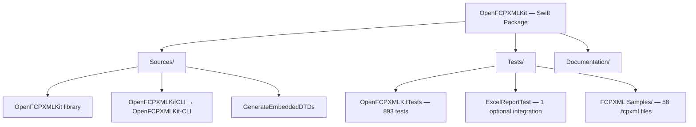
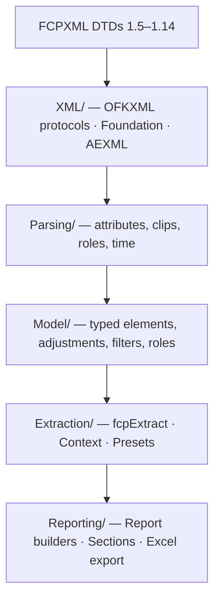
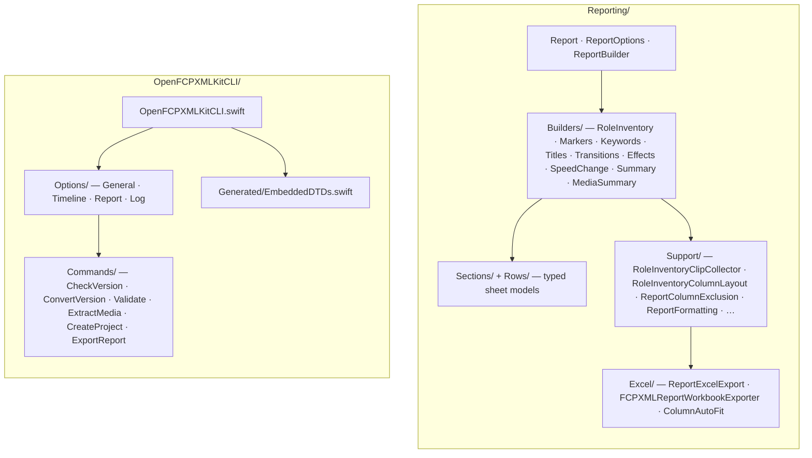
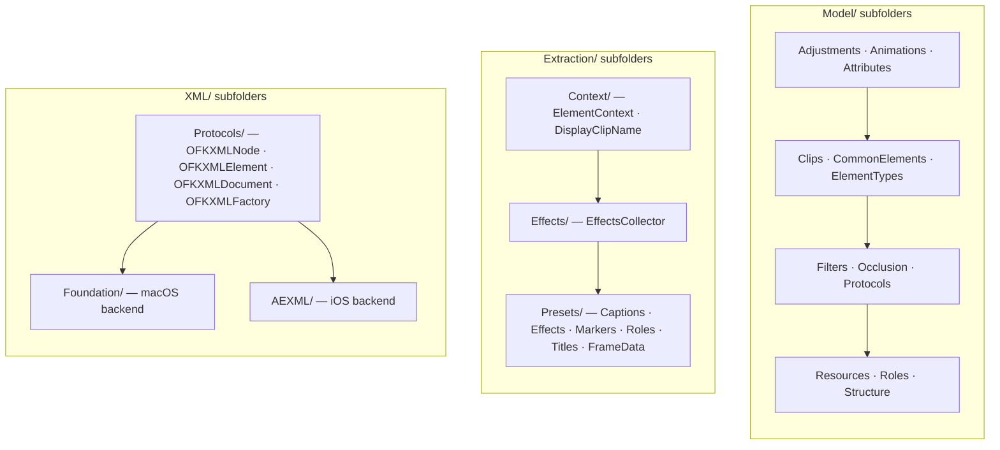

# OpenFCPXMLKit — Architecture & Conventions

A guide for contributors: project structure, architecture, naming, styling, and design decisions.

**See also:** [.cursorrules](.cursorrules), [AGENT.md](AGENT.md), [Tests/README.md](Tests/README.md).

---

## 1. Project overview

OpenFCPXMLKit is a **Swift 6** framework for Final Cut Pro FCPXML: parsing, creation, manipulation, and timecode operations (via SwiftTimecode). It is **protocol-oriented** and **dependency-injected**: core behaviour is behind protocols; default implementations are injectable; extension APIs that cannot take parameters use a single shared instance.

- **Package:** `OpenFCPXMLKit` (`swift-tools-version: 6.3`)
- **Products:** `OpenFCPXMLKit` (library, includes XLKit Excel export), `OpenFCPXMLKit-CLI` (executable), `GenerateEmbeddedDTDs` (internal build tool)
- **Targets:** macOS 26+, iOS 26+, Xcode 26+, Swift 6.3+
- **Repository:** https://github.com/TheAcharya/OpenFCPXMLKit
- **Dependencies:** SwiftTimecode 3.1.2+, SwiftExtensions 2.2.0+, swift-log 1.14.0+, AEXML 4.7.0+, swift-argument-parser 1.8.2+ (CLI only), Foundation, CoreMedia.
- **FCPXML:** Versions 1.5–1.14 (DTDs included); Final Cut Pro frame rates (23.976, 24, 25, 29.97, 30, 50, 59.94, 60).
- **Tests:** **894** tests listed in `swift test` — **893** in `OpenFCPXMLKitTests` (890 XCTest `func test` + 3 Swift Testing `@Test`) and **1** optional `ExcelReportTest` integration; **58** sample `.fcpxml` files under `Tests/FCPXML Samples/FCPXML/`.

---

## 2. Architecture

### 2.1 Protocol-oriented design

All major operations are defined as **protocols** with both **sync** and **async/await** methods. Default implementations live in `Implementations/`; callers inject dependencies into `FCPXMLUtility` or `FCPXMLService`.

| Protocol(s) | Implementation |
|-------------|----------------|
| FCPXMLParsing, FCPXMLElementFiltering | FCPXMLParser |
| TimecodeConversion, FCPXMLTimeStringConversion, TimeConforming | TimecodeConverter |
| XMLDocumentOperations, XMLElementOperations | XMLDocumentManager |
| ErrorHandling | ErrorHandler |
| CutDetection | CutDetector |
| FCPXMLVersionConverting | FCPXMLVersionConverter |
| MediaExtraction | MediaExtractor |
| MIMETypeDetection | MIMETypeDetector |
| AssetValidation | AssetValidator |
| SilenceDetection | SilenceDetector |
| AssetDurationMeasurement | AssetDurationMeasurer |
| ParallelFileIO | ParallelFileIOExecutor |
| ServiceLogger | NoOpServiceLogger, PrintServiceLogger, FileServiceLogger |

Semantic and DTD validation use **concrete structs** (`FCPXMLValidator`, `FCPXMLDTDValidator`, `FCPXMLStructuralValidator`) that are injected; they are not behind protocols.

### 2.2 Single injection point for extensions

Extension APIs that **cannot take parameters** (e.g. `CMTime.fcpxmlString`, `XMLElement.fcpxDuration`) use **`FCPXMLUtility.defaultForExtensions`** (concurrency-safe). For custom services, use the **modular API** with the `using:` parameter (e.g. `CMTime+Modular`, `XMLElement+Modular`, `XMLDocument+Modular`).

- **Rule:** No hidden concrete types in extension APIs; use `defaultForExtensions` or inject via `using:`.

### 2.3 Facades

- **FCPXMLService** — Preferred facade: inject dependencies and call service methods (parse, convert, validate, save, media operations). Sync and async.
- **FCPXMLUtility** — Legacy/convenience facade; same dependencies and behaviour. Holds `defaultForExtensions`.
- **ModularUtilities** — `createService()` / `createCustomService()` for building a default or custom `FCPXMLService`; `validateDocument(_:)`; `processFCPXML(from:using:)`; `convertTimecodes(...)`.

### 2.4 Concurrency

- **Sendable** where appropriate; Swift 6 strict concurrency (`-strict-concurrency=complete`) in CI.
- **Foundation XML** (XMLDocument, XMLElement), the **OFKXML** protocol types (OFKXMLDocument, OFKXMLElement) that wrap them, and **SwiftTimecode** types are not Sendable. The codebase provides **async/await** APIs but avoids Task-based concurrency over these types.
- Use `async/await` for asynchronous operations; use `Task`/`TaskGroup` only where types are Sendable.

### 2.5 Cross-platform XML (iOS support)

- **XML abstraction:** All document/element access goes through **protocols** (OFKXMLNode, OFKXMLElement, OFKXMLDocument, OFKXMLFactory). On **macOS** the default backend is Foundation (FoundationXMLElement, FoundationXMLDocument, FoundationXMLFactory). On **iOS** the backend is AEXML (AEXMLBackendElement, AEXMLBackendDocument, AEXMLBackendFactory). Use **OFKXMLDefaultFactory()** so the correct backend is used for the current platform.
- **DTD validation:** Full DTD validation is macOS-only. **FCPXMLDTDValidator** on iOS uses **FCPXMLStructuralValidator** (root, version, resources, element allowlist) and may add a `structuralValidationOnly` warning.

### 2.6 Error handling

- **Sync:** `Result<T, FCPXMLError>` or `do`/`catch`.
- **Async:** `throw` and propagate `FCPXMLError` (e.g. `parsingFailed(Error)`).
- **Module errors:** `FCPXMLError`, `FCPXMLLoadError`, `FCPXMLExportError`, `FCPXMLBundleExportError`, `FinalCutPro.FCPXML.ParseError`, `TimelineError`. Parse failures from all layers surface as `FCPXMLError.parsingFailed`.

### 2.7 Reporting and core layers

Workbook **reporting** (`Reporting/`) sits at the top of the stack. It maps already-extracted FCPXML facts into row models and sheet sections. It is **not** where new FCPXML semantics should first be implemented.

When FCPXML grows more complex (nested sync-clips, compound clips, richer adjustments, role inheritance, occlusion, per-span metadata), extend the engine **bottom-up** so CLI, extraction presets, timeline tools, and reports share one foundation:

```text
XML/              OFKXML protocols and platform backends (Foundation, AEXML)
    ↓
Parsing/          Attribute and structure parsing (time, roles, clips, metadata)
    ↓
Model/            Typed elements, adjustments, filters, roles, occlusion
    ↓
Extraction/       fcpExtract, ExtractionScope, timeline/role context
    ↓
Reporting/        Row models, builders, sheet-specific presentation rules
```

**1. Model and Parsing** — Add or extend typed coverage first:

- New element types in `FCPXMLElementType` and `Model/` (clips, adjustments, filters, resources).
- Attribute parsing in `Parsing/` and element extensions on `OFKXMLElement`.
- Shared value types (e.g. transform adjustments, volume spans) that any consumer can reuse.

**2. Extraction** — Expose consistent context for callers:

- Timeline absolute start/end via extraction context (`ExtractedElement`, `ElementContext`).
- Inherited roles, occlusion, sync/mc/ref-clip traversal rules in `Extraction/`.
- Presets and scope flags (`ExtractionScope`, `includeDisabled`, `occlusions`) rather than ad hoc XML walks.

**3. Reporting** — Keep thin:

- Builders call `fcpExtract` and shared context helpers (`ElementContext`, effect/title contexts).
- Sheet-specific **presentation policy** only: column order, string formatting, sort order, inclusion allowlists (e.g. which custom filters appear on an effects sheet), workbook column exclusion (`ReportColumn`, `ReportColumnExclusion`), workbook cell colours (`FCPXMLReportWorkbookExporter`, `RoleRowColorContext`), and optional cover-sheet branding.
- `ReportOptions.excludeDisabledClips` flows into `ExtractionScope.includeDisabled` at build time so disabled clips are omitted consistently across all timeline-based sections.
- Do **not** duplicate timeline math, role resolution, or element traversal that belongs in Extraction/Model.

**Where to put a change**

| Concern | Layer |
|--------|--------|
| New `adjust-*` or `filter-*` element understood from XML | Model, Parsing |
| Correct absolute timeline for a nested clip or effect span | Extraction |
| Which rows appear on a given workbook sheet | Reporting |
| Column labels, timecode strings, enabled checkmarks | Reporting |
| Omit `enabled="0"` clips from all timeline sections | `ReportOptions.excludeDisabledClips` → Extraction scope |
| Omit named columns from every applicable sheet | `ReportOptions.excludedColumns` → `Report.excludedColumns` → Excel export |
| Workbook cell colours (inventory role category; section-sheet `RoleRowColorContext`; Summary header-style title + black data; Media Summary red paths; marker-type colours) | `FCPXMLReportWorkbookExporter` |
| Missing media path list | Media Summary builder (`mediaBaseURL` for relative paths) |

**Workflow when a report gap appears**

1. Confirm whether the fact already exists in Model or Extraction; use it if so.
2. If the fact is missing, implement it in Model/Parsing, then wire it through Extraction.
3. Only then add or adjust Reporting builders to map that fact to rows.
4. Add **core** tests (parsing, extraction, occlusion, roles) alongside **report** integration tests that assert row shape against an optional local FCPXML fixture.

**Excel export** lives under **`Reporting/Excel/`** and serialises `Report` to XLKit workbooks via `ReportExcelExport` and `FCPXMLReportWorkbookExporter`; it applies column exclusion, tabular header styling (black fill, white bold text), and sheet-specific row text colours but should not introduce new FCPXML interpretation.

---

## 3. Project structure

### 3.1 Codebase map

The package builds one library, one CLI executable, and one internal build tool. The diagrams below read **top to bottom**. The library is layered bottom-up (see §2.7): **FCPXML DTDs** and the platform-agnostic **XML** layer feed **Parsing**, which builds the typed **Model**, which **Extraction** exposes with timeline/role context, which **Reporting** maps into workbook sheets. Cross-cutting subsystems (Classes, Implementations, Protocols, Services, Timeline, Export, Validation, etc.) sit alongside that pipeline.

#### Package layout



#### Library layer stack (bottom → top)



#### Reporting and CLI detail



#### Model, Extraction, and XML subfolders



**Cross-cutting library folders** (alongside the layer stack): Analysis, Annotations, Classes, Delegates, Errors, Extensions (+Modular, +Codable), Implementations, Protocols, Services, Utilities, Export, Timeline, Timing, Validation, FileIO, Media, Logging, Format.

### 3.2 Library folders

Source layout under **`Sources/OpenFCPXMLKit/`**:

| Folder | Purpose |
|--------|---------|
| **Analysis** | EditPoint, CutDetectionResult (cut detection). |
| **Classes** | FinalCutPro, FCPXML, FCPXMLElementType, FCPXMLUtility, FCPXMLVersion, FCPXMLRoot, FCPXMLRootVersion, FCPXMLInit, FCPXMLProperties. |
| **Delegates** | AttributeParserDelegate, FCPXMLParserDelegate (internal). |
| **Errors** | FCPXMLError, FCPXMLParseError, TimelineError. |
| **Extensions** | CMTime, XMLElement, XMLDocument (+Modular, +Codable, and non-modular). FCPXML extensions operate on OFKXMLElement/OFKXMLDocument protocol types. |
| **Implementations** | Default implementations of all protocols above. |
| **Protocols** | All operation protocols. |
| **Services** | FCPXMLService. |
| **Utilities** | ModularUtilities, FCPXMLTimeUtilities, FCPXMLUID, FCPXMLCodableConverter, EmbeddedDTDProvider, FCPXMLDTDAllowlistGenerator, ProgressBar, ProgressBarStyle, SequencePlusAnySequence, XMLElementAncestorWalking, XMLElementSequenceAttributes. |
| **Annotations** | Marker, ChapterMarker, Keyword, Rating, Metadata (creation-oriented). |
| **Export** | FCPXMLExporter, FCPXMLBundleExporter, FCPXMLExportAsset. |
| **Timeline** | Timeline, TimelineClip (TimelineFormat presets live in Timeline.swift). |
| **Timing** | FCPXMLTimecode. |
| **Validation** | FCPXMLValidator, FCPXMLDTDValidator, FCPXMLStructuralValidator (cross-platform; used on iOS when DTD unavailable), ValidationResult, ValidationError/Warning, DocumentValidationReport. |
| **FileIO** | FCPXMLFileLoader. |
| **Logging** | ServiceLogger, ServiceLogLevel, NoOp/Print/FileServiceLogger. |
| **Media** | MediaReference, MediaExtractionResult, MediaCopyResult. |
| **Format** | ColorSpace. |
| **Model** | FCPXML element models: Adjustments, Animations, Attributes, Clips, CommonElements, ElementTypes, Filters, Occlusion, Protocols, Resources, Roles, Structure (CollectionFolder, KeywordCollection, etc.). |
| **Parsing** | XML parsing extensions (Attributes, Clip, Elements, Metadata, Resources, Roles, Root, Time and Frame Rate). |
| **Extraction** | `fcpExtract`, ExtractedElement, ExtractionScope, ExtractableChildren. **Context/** (DisplayClipName, ElementContext, ElementContextItems/Tools, FrameRateSource), **Effects/** (EffectsCollector, ExtractedEffect), **Presets/** (Captions, Effects, FrameData, Markers, Roles, Titles, plus the base ExtractionPreset). |
| **Reporting** | Excel workbook reports. Top-level: `Report`, `ReportOptions`, `ReportBuilder`, `ReportBuildProgress`. **Builders/** — per-sheet builders including `MediaSummaryReportBuilder` (missing media paths) and split `SummaryReportBuilder` (project metrics + role durations). **Sections/** and **Rows/** — typed section/row models (`Selected Roles Inventory`, Markers, Keywords, Titles & Generators, Transitions, Effects, Speed Change Effects, Summary, Media Summary). **Support/** — `RoleInventoryClipCollector`, `RoleInventoryRowBuilder`, `RoleInventoryColumnLayout` (Row + 23 fixed columns + dynamic metadata keys), `RoleInventoryRoleSheetOrdering`, `RoleInventoryTimelineBounds`, `ReportFormatting`, `ReportRoleExclusion`, `ReportColumnExclusion` (`ReportColumn` global column omission), `ReportClipCategory`, `EffectsReportPolicy`, `SpeedChangeFormatting`, `SummaryRoleDurationAggregator`. **Excel/** — `ReportExcelExport`, `FCPXMLReportWorkbookExporter` (applies `Report.excludedColumns`, `RoleRowColorContext` sheet-specific row colours, inventory role-category tints, Summary project-title header + black data rows, Media Summary red missing-media paths, marker-type colours), `ReportWorkbookColumnAutoFit`. `ReportOptions`: `excludeDisabledClips`, `excludedColumns`, `includeMediaSummary`, `mediaBaseURL`. Consumes Extraction; owns presentation only — see §2.7. |
| **XML** | Platform-agnostic XML layer: Protocols (OFKXMLNode, OFKXMLElement, OFKXMLDocument, OFKXMLDTDProtocol, OFKXMLFactory), Foundation/ (Foundation backends), AEXML/ (AEXML backends), OFKXMLDefaultFactory. |
| **FCPXML DTDs** | Version 1.5–1.14 DTDs. |

**CLI:** `Sources/OpenFCPXMLKitCLI/` — commands (`CheckVersion`, `ConvertVersion`, `Validate`, `ExtractMedia`, `CreateProject`, `ExportReport`), option groups (`GeneralOptions`, `TimelineOptions`, `ExtractionOptions`, `ReportCLIOptions`, `LogOptions`), embedded DTDs (`Generated/EmbeddedDTDs.swift`).

**Internal tool:** `Sources/GenerateEmbeddedDTDs/` — generates embedded DTD source for the CLI.

**Root:** `Version.swift` — package version constant at target root.

---

## 4. Naming conventions

### 4.1 Swift identifiers

- **Types & protocols:** PascalCase (e.g. `FCPXMLParser`, `FCPXMLParsing`).
- **Variables & functions:** camelCase.
- **Descriptive names** for all public APIs; avoid abbreviations except common ones (e.g. URL, ID).
- **No marketing terms in code:** Never use "PBF" or "Production's Best Friend" in source code, code comments, symbol names, or CLI/log output. Name the reporting feature neutrally (e.g. `Report`, `RoleInventoryReportBuilder`, "Excel report", "workbook export"). Those terms may appear only in prose documentation (README, CHANGELOG, Manual, and these agent guides) — never in the codebase itself.

### 4.2 File names

- **No spaces** in `.swift` file names. Use PascalCase-style names (e.g. `FCPXMLRoot.swift`, `FCPXMLTimeUtilities.swift`, `FCPXMLTimeAndFrameRateParsing.swift`).
- **Extension files:** Keep the `+` suffix (e.g. `CMTime+Modular.swift`, `XMLElement+Modular.swift`).
- **One primary type or concern per file** where practical; file name usually matches the main type or topic.

### 4.3 Special file names (collision avoidance)

- `FCPXMLElementOcclusionCalculation.swift` — occlusion calculation utility (distinct from `FCPXMLElementOcclusion.swift`).
- `FCPXMLExtractedElementStruct.swift` — struct `ExtractedElement` (protocol in `FCPXMLExtractedElement.swift`).
- `FCPXMLElementTypeModel.swift` — parsing-layer `FinalCutPro.FCPXML.ElementType` (Classes/`FCPXMLElementType.swift` is the DTD enum).

---

## 5. Code style & file header

### 5.1 Swift style

- Swift 6.3 syntax and features; follow [Swift API Design Guidelines](https://swift.org/documentation/api-design-guidelines/).
- Use value types where appropriate; avoid force unwrapping; use optionals and `Result`/`throw` for failure.

### 5.2 File header (required for new Swift files)

```swift
//
//  FileName.swift
//  OpenFCPXMLKit • https://github.com/TheAcharya/OpenFCPXMLKit
//  © 2026 • Licensed under MIT License
//

//
//	Brief description of the file's purpose.
//
```

- Replace `FileName.swift` with the **actual** file name.
- Purpose block: **tab** after `//`, not spaces.
- Two blank lines between header block and purpose block.
- Do **not** add `Created by`, extra `Copyright ©` lines, or legacy project names.

### 5.3 Documentation

- **Public APIs:** `///` doc comments; document parameters, return values, and thrown errors; include usage examples where helpful.
- **README / Manual:** Update when adding features or changing behaviour.

---

## 6. Design decisions

- **FCPXMLParser** delegates URL loading to **FCPXMLFileLoader** (one code path for .fcpxml and .fcpxmld).
- **FCPXMLVersion** (1.5–1.14, DTD) and **FinalCutPro.FCPXML.Version** (1.0–1.14, parsing) are bridged via `.fcpxmlVersion`, `.dtdVersion`, and `init(from:)`.
- **Version conversion** sets root version and **strips elements** not in the target DTD (e.g. adjust-colorConform, adjust-stereo-3D). Per-version DTD validation via `FCPXMLService.validateDocumentAgainstDTD(_:version:)` and `validateDocumentAgainstDeclaredVersion(_:)`.
- **Timeline** is a value type; manipulation methods (e.g. ripple insert, auto lane) return new instances or results; timestamps (`createdAt`, `modifiedAt`) are updated on mutating operations.
- **SwiftTimecode:** Use `Timecode(.realTime(seconds:), at: frameRate)` and frame rate cases `.fps23_976`, `.fps24`, `.fps25`, etc. (not the old `._24`, `._25`).
- **Cross-platform XML:** Use `OFKXMLDefaultFactory()` when creating documents/elements so iOS gets the AEXML backend. All parsing and model code uses `any OFKXMLDocument` / `any OFKXMLElement`; the concrete type is chosen at runtime.
- **Logging:** `ServiceLogger` protocol with `ServiceLogLevel`; inject via `FCPXMLService` / `FCPXMLUtility` or build from CLI `LogOptions.makeLogger()`.
- **Service factory:** `ModularUtilities.createService()` returns a fully configured `FCPXMLService`; `createCustomService(...)` accepts custom protocol implementations.

---

## 7. CLI

Binary name: **`OpenFCPXMLKit-CLI`**. Mutually exclusive modes: `--check-version`, `--convert-version`, `--extension-type` (fcpxmld | fcpxml), `--validate`, `--media-copy`, `--report`, `--create-project` (requires `--width`, `--height`, `--rate`, `--project-version`, output-dir).

**`--report`** builds an Excel workbook (role inventory by default — **Selected Roles Inventory** + per-role sheets). `--report-full` adds every optional sheet. Per-section flags: `--report-markers`, `--report-keywords`, `--report-titles-generators`, `--report-transitions`, `--report-effects`, `--report-speed-change-effects`, `--report-summary`, `--report-media-summary`. Filtering: `--exclude-role` (repeatable), `--exclude-column` (repeatable; global column omission), `--exclude-disabled-clips` (omit `enabled="0"` clips), `--report-project`. Log options: `--log`, `--log-level`, `--quiet`. See `Sources/OpenFCPXMLKitCLI/README.md` and `Documentation/Manual/16-CLI.md`.

---

## 8. Tests

- **Count:** **894** listed in `swift test` — **893** in `OpenFCPXMLKitTests` (890 XCTest + 3 Swift Testing `@Test` in `FCPXMLReportRoleExclusionTests`) and **1** in optional `ExcelReportTest` (skips without a local `.fcpxml`/`.fcpxmld` fixture).
- **Location:** `Tests/OpenFCPXMLKitTests/`; samples in `Tests/FCPXML Samples/FCPXML/` (58 files); optional integration under `Tests/ExcelReportTest/`.
- **Utilities:** `FCPXMLTestResources.swift`, `FCPXMLTestUtilities.swift` (path resolution, sample loading; `XCTSkip` when a sample is missing); `FCPXMLReportingReportFixture.swift` / `FCPXMLReportingReportTestSupport.swift` for optional reporting fixtures.
- **Reporting tests:** include `FCPXMLRoleInventoryColumnLayoutTests`, `FCPXMLReportColumnExclusionTests`, `FCPXMLReportExcludeDisabledClipsTests`, `FCPXMLReportExcelExportTests` (workbook cell formatting: Summary title header, black role-duration data, red missing-media paths, inventory/section-sheet colour rules), plus existing role inventory, section, Excel export, and formatting tests.
- **Coverage:** Unit, integration, and performance tests; sync and async; all supported frame rates and FCPXML versions. See **Tests/README.md** for categories and how to run tests.

---

## 9. Git & quality

- **Branches:** main, dev, feature/*, bugfix/*.
- **Commits:** Clear, imperative subject; optional body; reference issues when applicable.
- **Before merge:** All tests passing, docs updated, no new warnings; concurrency and error handling reviewed.

---

## 10. References

- **Internal:** [.cursorrules](.cursorrules), [AGENT.md](AGENT.md), [Documentation/Manual.md](Documentation/Manual.md), [Tests/README.md](Tests/README.md).
- **External:** [Final Cut Pro XML](https://fcp.cafe/developers/fcpxml/), [SwiftTimecode](https://github.com/orchetect/swift-timecode), [Swift API Design Guidelines](https://swift.org/documentation/api-design-guidelines/), [Swift Concurrency](https://docs.swift.org/swift-book/documentation/the-swift-programming-language/concurrency/).
